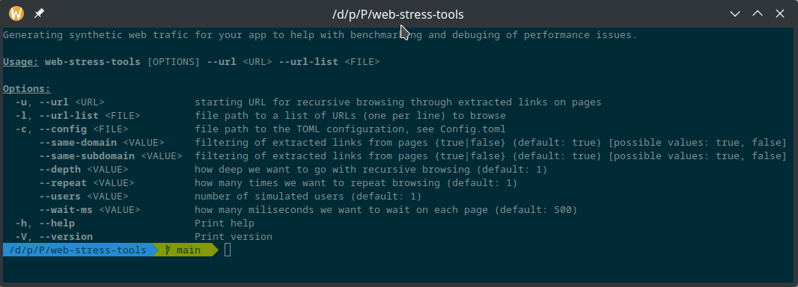
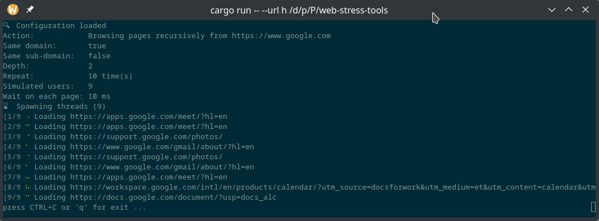

# web_stress_tools
Easy to use console application for web application stress testing.
Inspired by WGET. 

## How to use it

You can use 2 modes how to generate a traffic:

* By specifying starting URL (--url) the app will extract links on each page and go through them. 
  * You can set how deep will app go by setting --depth option.
* By providing file with URLs (URL for each line) the app will go through the list. 

You can set other options like a number of simulated users or wait time on each page by command line argument or in TOML configuration file. See Config.toml example file.
Generally, the command line arguments have higher priority and overriding config file.

## Supported targets

* x86_64-unknown-linux-gnu
* x86_64-pc-windows-gnu 

## About

Main purpose of this app is to help with stress testing and also for me to learn Rust language. 
I was using various applications to generate synthetic traffic in the past. MS Web Stress Tools long time ago, Selenium or WGET. 

Problem I'm trying to solve is to have simple and easy to use application which would be able to simulate realistic traffic. 
I want to keep it simple as WGET is but also introduce advanced features like parallel users. 

I've faced problems with rust headless_chrome so the initial version is using simple web requests to the server. 
Adding headless chrome or different engine is the main goal for the future version. 

## Roadmap

I'm not planning to add more functionality. 
The tool is helpful to me as it is, and I've learned a bit about Rust as well. 
There are definitely some small bugs or space for improvement. I'm happy to fix bugs If anyone will use the tool and report it.

